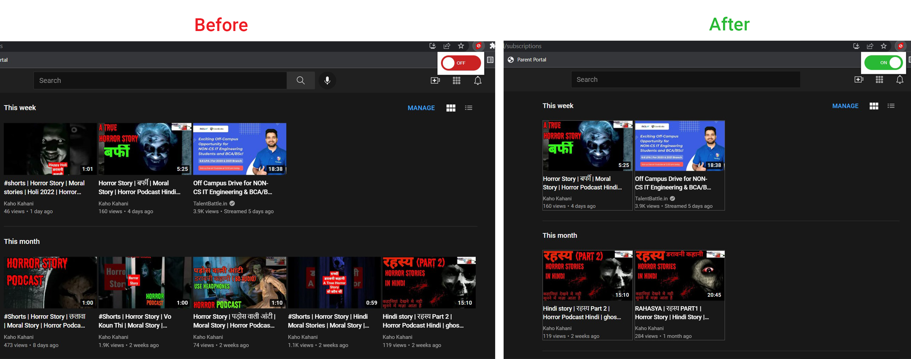
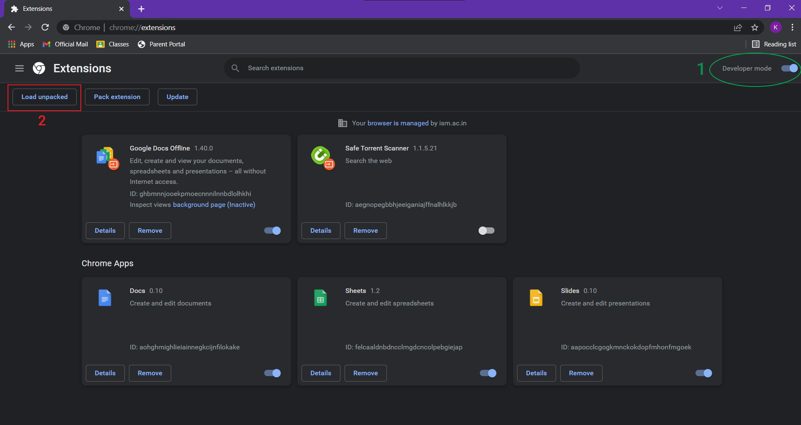
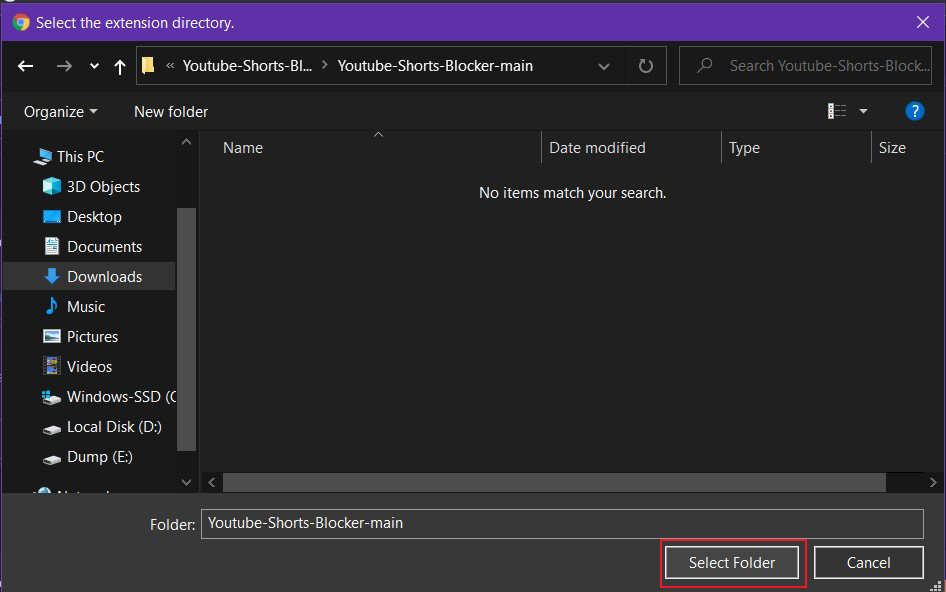
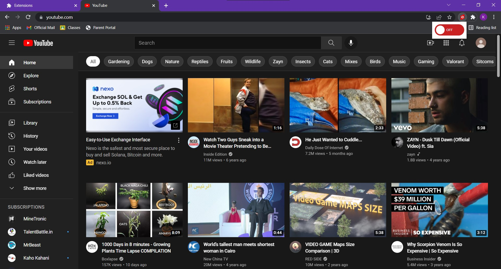
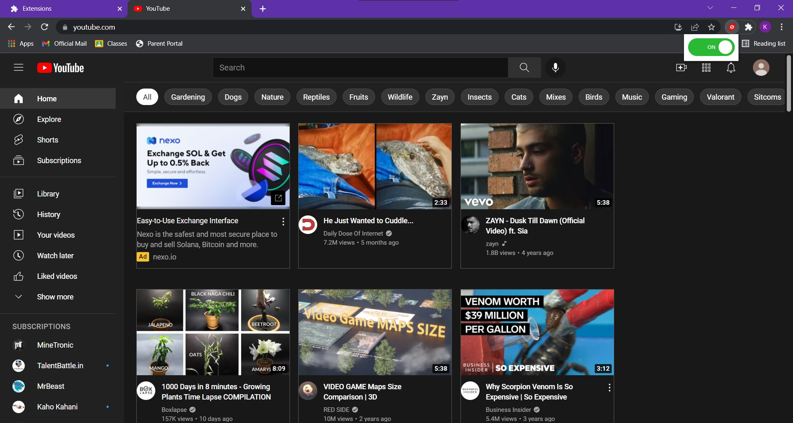

# Youtube Shorts Blocker

A chrome extension that blocks youtube shorts (videos with duration less than 1:04 minutes). Uses CSS selectors to target videos and removes them from DOM. Also outlines processed elements with subtle colour.

## Tech Used

## Usage and Screenshots

1. Download and unzip repository folder.

2. Open chrome and open extension management or go to path:
> chrome://extensions/

3. Turn on "developer mode" and click "load unpacked"

4. Browse and select folder containing files

5. Open Youtube and click extension icon to view toggle switch

6. Click to toggle extension

